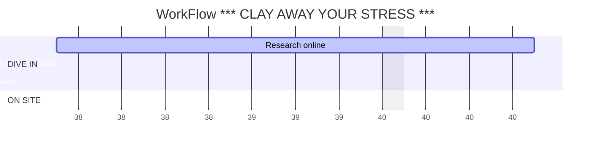

# *** CLAY AWAY YOUR STRESS ***

### ClayGround store project   *the real store next to my new apartment. all other details about the project are fictional 

#### dummy Friday project

The main purpose of the client is to **_increase the sales of products_**(stuff&services), **make clay _workshops_ popular**. The main marketing background : clay *helps* to ***relif stress***. 

>>A lot of workers *imagine _beatting_ their boss*. In Japan there are special rooms to throw the plates into his picture, etc. We does not have the chance to do it in EU. But you're ***warmly welcomed*** to create your boss with a clay and broke it. Or you can give it as a present to your angry colleagues.

